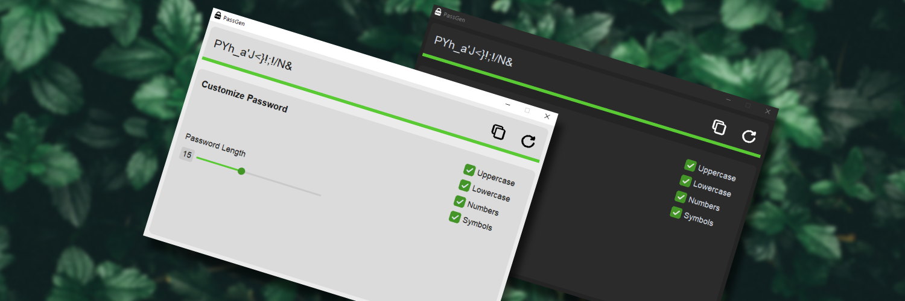

  <picture>
    
  </picture>

# PassGen 
PassGen is a password generator app that lets you create random passwords based on your preferences. You can customize settings such as password length and choose whether to include uppercase letters, lowercase letters, numbers, or symbols in the generated password. Additionally, it provides a color-coded indicator below the password to show its strength, with green indicating a strong password and red indicates less effective ones.

## Usage

To use the app, all you have to do is launch it, select the settings you want for the password generation, and click on the generate icon. 
After your password has been generated, you can copy it and use it anywhere you like!

### Hotkeys
The app also has a couple hotkeys you can use:
- `Ctrl+G` will generate a password.
- `Ctrl+C` will copy the generated password.
- `Ctrl+T` will switch theme. 

## Info
PassGen is codded in [Python](https://www.python.org/) using mainly [CustomTkinter](https://customtkinter.tomschimansky.com/) for the UI.

 

## Demo
https://github.com/jjkay03/PassGen/assets/61110962/e0dae5e9-9bfd-4242-a2b8-ff296f849856

